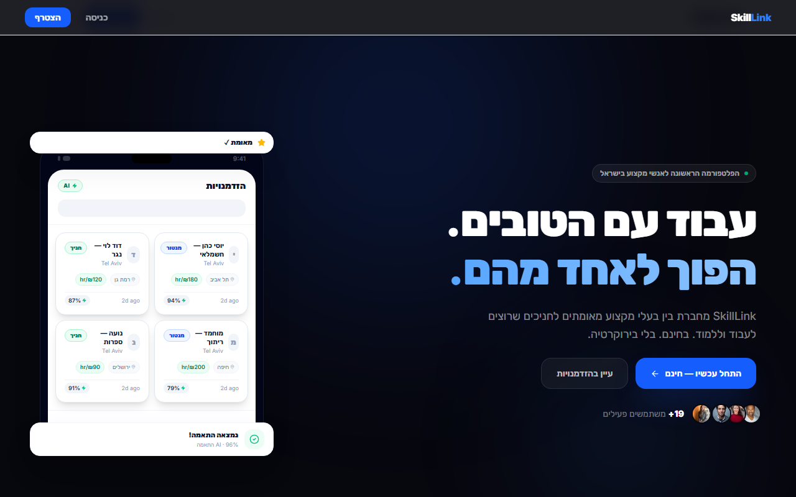
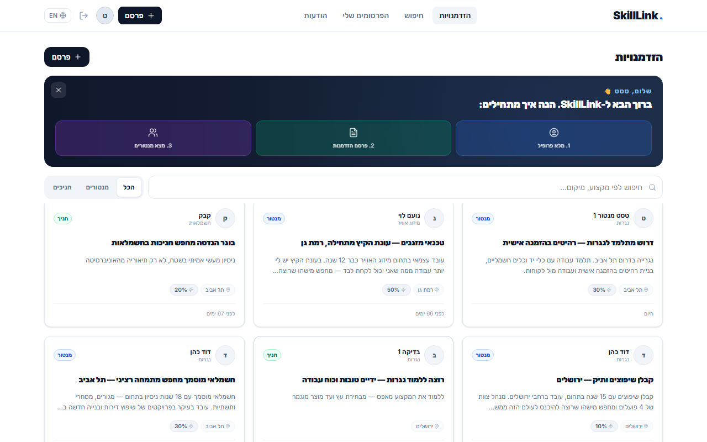
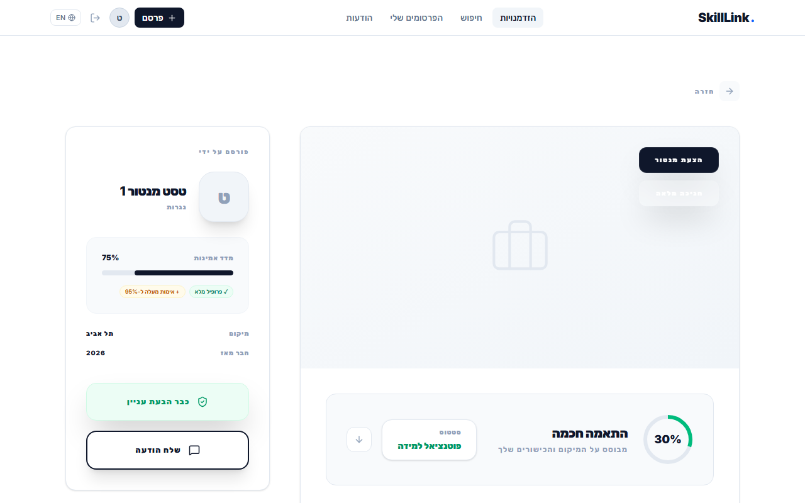

<div dir="rtl">

# SkillLink — פלטפורמת השוליאות המקצועית של ישראל

**מרקטפלייס דו-צדדי שמחבר בעלי מקצוע מנוסים (מנטורים) עם מתלמדים שרוצים ללמוד מקצוע בשטח — עבודה אמיתית, שכר אמיתי, בלי בירוקרטיה.**




## הבעיה

- **למתלמד:** אין דרך ללמוד מקצוע מעשי (נגרות, חשמלאות, אינסטלציה...) בלי תואר או קורס יקר — ואין דרך להוכיח ניסיון.
- **למנטור:** קשה למצוא עוזרים מחויבים שבאמת רוצים ללמוד את המקצוע.
- **לשוק:** מחסור חמור בבעלי מקצוע צעירים בישראל.

## הפתרון

פלטפורמה שבה מנטור מפרסם הזדמנות חניכה ("דרוש מתלמד לנגרות"), מתלמד מחפש לפי מקצוע ומיקום, מערכת ההתאמה מדרגת רלוונטיות, והשניים מדברים בצ'אט מובנה. בסוף התהליך — ביקורות מאומתות שבונות רקורד מקצועי.

| | |
|---|---|
|  |  |

## סטאק טכנולוגי

| שכבה | טכנולוגיה |
|---|---|
| Frontend | React 19, TypeScript, Vite, Tailwind CSS 4, framer-motion |
| Backend | Supabase — Auth, PostgreSQL + RLS, Storage, Realtime, Edge Functions |
| AI | Gemini API דרך Edge Function (המפתח לא נחשף בלקוח) |
| Hosting | Vercel (static SPA) |
| בדיקות | Vitest, React Testing Library, בדיקות RLS ב-SQL |
| CI | GitHub Actions — type check, tests, build על כל push |

אין שרת ייעודי: כל הלוגיקה רצה בצד הלקוח מול Supabase, וההרשאות נאכפות ב-DB עצמו באמצעות Row Level Security. פירוט מלא ב-[docs/ARCHITECTURE.md](docs/ARCHITECTURE.md).

## הרצה מקומית

דרישות: Node.js 20+

<div dir="ltr">

```bash
npm install

# .env with:
# VITE_SUPABASE_URL=...
# VITE_SUPABASE_ANON_KEY=...
# (Gemini key is a server-side Edge Function secret, not a client var —
#  see docs/LAUNCH_CHECKLIST.md)

npm run dev        # dev server on http://localhost:5173
```

</div>

## בדיקות

<div dir="ltr">

```bash
npm run lint       # TypeScript type check
npm test           # 34 unit/component tests (Vitest + RTL)
npm run test:e2e   # 23 end-to-end tests (Playwright, desktop + mobile)
```

</div>

**בדיקות E2E (Playwright):** רצות מול dev server אמיתי בשני profiles (Desktop Chrome + Pixel 7). המסלולים הציבוריים (נחיתה, ולידציית טפסים, אשף הרשמה, redirect לאורח) רצים ללא התחברות; המסלול המאומת (feed → פתיחת הזדמנות → Explore → Inbox → פרופיל) מתחבר פעם אחת דרך `E2E_EMAIL`/`E2E_PASSWORD` ומדלג בהיעדרם.

**בדיקות אבטחה (RLS):** הסקריפט [supabase/tests/rls_tests.sql](supabase/tests/rls_tests.sql) מדמה שלושה משתמשים + אורח ומוכיח ב-16 בדיקות שמשתמש אחד לא יכול לקרוא או לכתוב נתונים פרטיים של אחר. מריצים אותו ב-SQL Editor של Supabase; הוא רץ בתוך טרנזקציה ומתגלגל לאחור בסופו. הבדיקות האלה מצאו (ותיקנו) שני חורי אבטחה אמיתיים — ראו [docs/SECURITY.md](docs/SECURITY.md).

## מבנה הפרויקט

<div dir="ltr">

```
src/
  pages/          # Route-level screens (Landing, Auth, Home, Profile, Messaging...)
  components/     # Shared components (OpportunityCard, Navbar, ProtectedRoute...)
  contexts/       # AuthContext — session, profile, unread counters
  lib/            # supabase client, chat API, connection tracking
  utils/          # matchScore — the matching algorithm
  services/       # Gemini AI integration
supabase/
  schema.sql      # Full schema: tables, RLS policies, triggers, buckets
  migrations/     # Incremental migrations applied to production
  tests/          # RLS security tests
docs/             # Architecture & security docs, screenshots
```

</div>

## תיעוד נוסף

- [docs/ARCHITECTURE.md](docs/ARCHITECTURE.md) — תרשים מערכת, סכמת DB, החלטות עיצוב
- [docs/SECURITY.md](docs/SECURITY.md) — מודל הרשאות, אימות מנטורים, פערים ידועים

</div>
