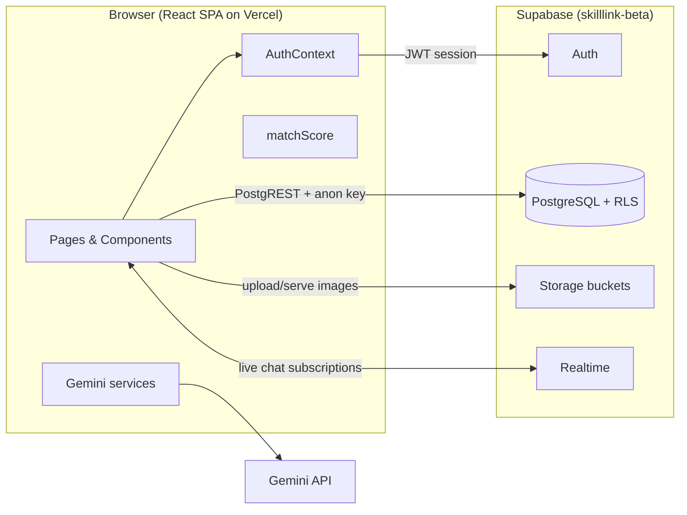
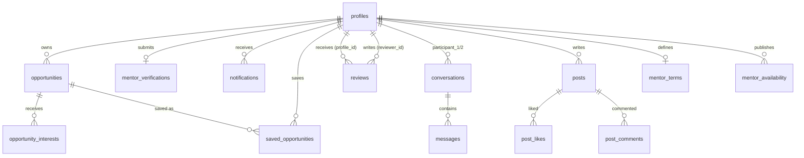
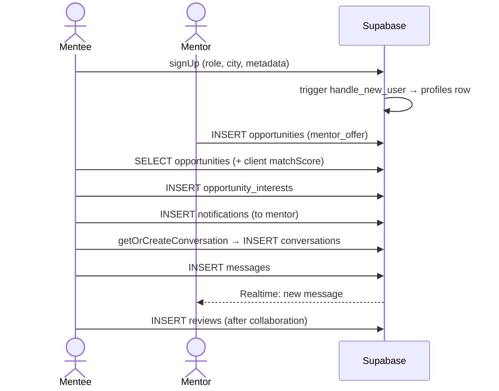

# ארכיטקטורה — SkillLink

## תמונה כללית

SkillLink היא Single-Page Application שרצה כולה בצד הלקוח. אין שרת אפליקציה: הלקוח מדבר ישירות עם Supabase (PostgreSQL דרך PostgREST, Auth, Storage, Realtime), וכל כללי ההרשאה נאכפים בשכבת ה-DB באמצעות Row Level Security. ה-SPA נבנה עם Vite ומוגש כקבצים סטטיים מ-Vercel.

**נקודת המפתח:** הלקוח מחזיק רק את ה-anon key. כל שאילתה עוברת דרך PostgREST עם ה-JWT של המשתמש, ו-Postgres מחיל את ה-RLS policies לפי `auth.uid()`. גם לקוח עוין עם ה-anon key לא יכול לגשת לנתונים של משתמש אחר — זה מוכח בבדיקות ב-`supabase/tests/rls_tests.sql`.

## סכמת הנתונים

### הטבלאות המרכזיות

| טבלה | תפקיד | נקודות חשובות |
|---|---|---|
| `profiles` | פרופיל משתמש (1:1 עם `auth.users`) | נוצר אוטומטית ב-trigger `handle_new_user`; העמודה היא `city` (לא `location`) |
| `opportunities` | הזדמנויות — הצעת מנטור או חיפוש מתלמד | `type`: `mentor_offer` / `mentee_seeking`; ציבורי לקריאה |
| `opportunity_interests` | "אני מעוניין" — PK מורכב (opportunity, user) | מונע עניין כפול ברמת DB |
| `conversations` | שיחה בין שני משתתפים | `UNIQUE(participant_1, participant_2)`; שדות מוכחשים `last_message`, `last_message_at` לביצועי Inbox |
| `messages` | הודעות צ'אט | Realtime subscription פר-שיחה; RLS מגביל למשתתפים בלבד |
| `notifications` | התראות in-app | נכתבות ע"י הצד השולח (interest, verification) |
| `reviews` | ביקורות — 4 ממדים + ציון כולל | `UNIQUE(profile_id, reviewer_id)` — ביקורת אחת למבקר |
| `mentor_verifications` | בקשות אימות מנטור עם מסמך מזהה | נקראות רק ע"י הבעלים או אדמין |
| `posts` / `post_likes` / `post_comments` | פיד קהילה (LiveCommunity) | פיצ'ר חלקי — קיים ב-DB, שימוש מוגבל ב-UI |
| `mentor_terms` / `mentor_availability` | תנאי ולוח זמנים של מנטור | שלב הבא במוצר (ראו VISION.md) |

### Storage buckets

| Bucket | ציבורי? | מדיניות כתיבה |
|---|---|---|
| `avatars`, `profile_covers`, `opportunities_images`, `post-images` | כן | משתמש כותב רק לתיקייה `<uid>/` שלו |
| `mentor_id_docs` | לא | קריאה: הבעלים או אדמין בלבד |

## Row Level Security — למה וכיצד

בארכיטקטורה בלי שרת, הלקוח הוא שטח עוין: כל אחד יכול לפתוח DevTools ולשלוח כל שאילתה עם ה-anon key. לכן ההרשאות חייבות לשבת ב-DB, לא ב-JavaScript.

עקרונות המימוש:

1. **RLS מופעל על כל 15 הטבלאות.** אין טבלה חשופה.
2. **ציבורי לפי החלטה, לא כברירת מחדל** — `profiles` ו-`opportunities` קריאים לכולם (זה מרקטפלייס), אבל הודעות, התראות, שמורים ואימותים מוגבלים לבעלים.
3. **כתיבה תמיד מזוהה** — `INSERT` policies עם `WITH CHECK` שכובל את הכותב ל-`auth.uid()`: הודעה רק ממשתתף בשיחה, ביקורת רק בשם עצמך, התראת מערכת (ללא שולח) רק מאדמין.
4. **אכיפה מוכחת, לא מוצהרת** — `supabase/tests/rls_tests.sql` מריץ 16 בדיקות שמתחזות למשתמשים שונים ומוודאות כל אחד מהכללים. הבדיקות האלו מצאו שני חורים אמיתיים שנסגרו (פירוט ב-SECURITY.md).

## החלטות עיצוב מרכזיות

### 1. Supabase BaaS במקום שרת ייעודי
**ההחלטה:** כל הלוגיקה בצד לקוח מול Supabase.
**חלופה שנדחתה:** שרת Express + SQLite + socket.io (הפרויקט אף התחיל כך — הקוד הוסר ב-commit `0ca9b58` אחרי שהלקוח הועבר כולו ל-Supabase).
**נימוקים:** free tier מלא (DB, Auth, Storage, Realtime), אפס תחזוקת שרת, RLS נותן מודל הרשאות חזק יותר מ-middleware ידני, ו-Realtime מובנה לצ'אט. המחיר: לוגיקה רגישה (למשל אימות מנטור) דורשת policies זהירים במקום קוד שרת.

### 2. צ'אט על Supabase Realtime
**חלופה שנדחתה:** socket.io — דורש שרת קבוע ($) ומודל auth נפרד.
**המימוש:** subscription לערוץ פר-שיחה על `messages`, ועדכון מונה לא-נקראו דרך AuthContext. שדה `last_message` מוכחש על `conversations` כדי שה-Inbox ייטען בשאילתה אחת.

### 3. ציון התאמה (match score) בצד הלקוח
**חלופה שנדחתה:** דירוג AI בצד שרת לכל feed — יקר, איטי, ולא אפשרי בלי שרת.
**המימוש:** היוריסטיקה שקופה ב-`src/utils/matchScore.ts` — מיקום (40), התאמת תפקיד ותחום (30), אמון והשלמת פרופיל (30), עם טבלת אזורים גיאוגרפיים לישראל. מכוסה ב-11 בדיקות יחידה.

### 4. פרופיל נוצר ב-DB trigger, לא בקוד לקוח
`handle_new_user` (SECURITY DEFINER) יוצר שורת `profiles` אטומית עם ההרשמה. כך אין מצב של משתמש בלי פרופיל גם אם הלקוח קרס באמצע. מטא-דאטה מההרשמה (שם, תפקיד, עיר) עוברת דרך `raw_user_meta_data`.

### 5. עברית/RTL כברירת מחדל
`document.documentElement.dir` נקבע לפני טעינת React (סקריפט inline ב-index.html) כדי למנוע הבהוב LTR. כל הרכיבים משתמשים ב-Tailwind logical utilities (`rtl:`) ותומכים בשתי השפות.

## זרימות מרכזיות

## חוב טכני ידוע

- קבצי ה-bundle גדולים (~1.1MB) — אין code splitting; מועמד ל-`React.lazy` פר-route.
- פיצ'ר הקהילה (posts) ופרופיל עסקי קיימים חלקית.
- אזהרת React על controlled inputs באשף פרסום הזדמנות — קוסמטי.
- `schema.sql` הוא snapshot; מקור האמת המצטבר הוא `supabase/migrations/`.

